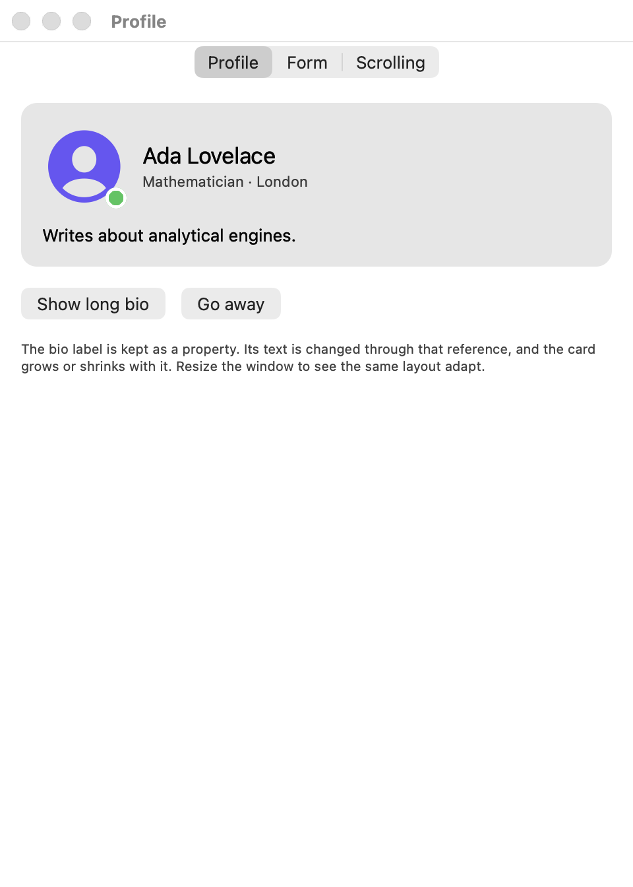
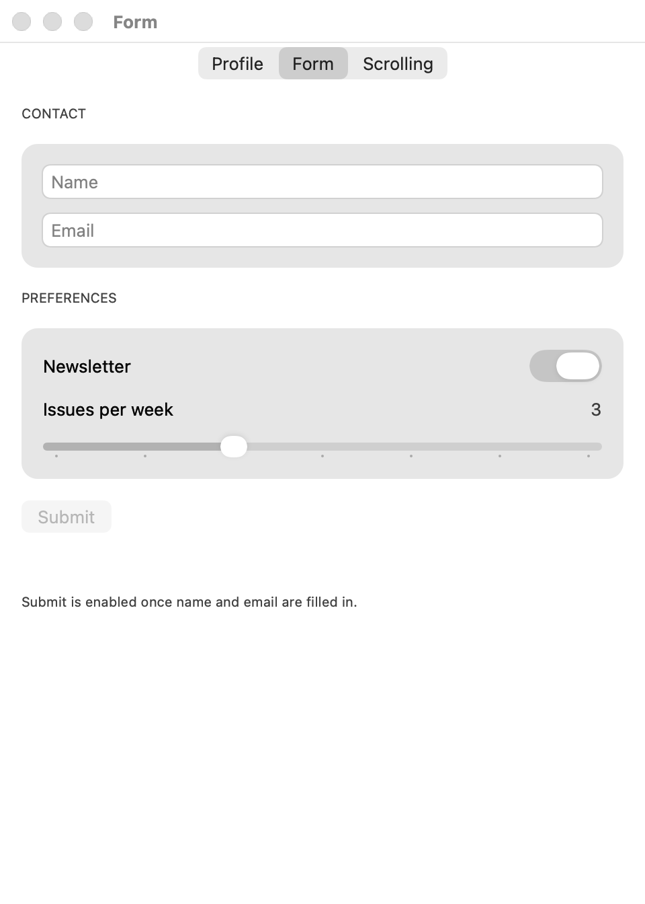
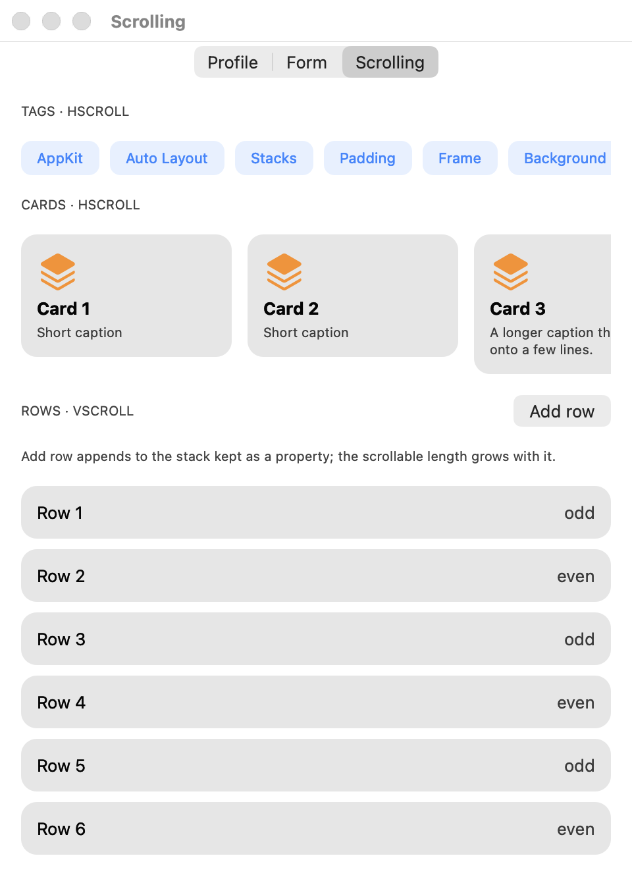

# DeclarativeAppKit

[English](README.md) | **简体中文** | [繁體中文](README.zh-Hant.md)

一个轻量的 AppKit 声明式布局库：在原生 `NSView` 与 Auto Layout 之上提供 SwiftUI 风格的 stack、padding 与 modifier，不依赖任何第三方库。

它没有渲染层，也不维护平行的视图层级。它返回的始终是真正的 `NSView` 或其子类，因此可以与现有 AppKit 代码自由混用。

数据绑定由配套的包 [DeclarativeCombine](https://github.com/nothingsh/DeclarativeCombine) 提供，见[数据绑定](#数据绑定)。

UIKit 版本见兄弟包 [DeclarativeUIKit](https://github.com/nothingsh/DeclarativeUIKit)。

```swift
view.addVStack(alignment: .leading, spacing: 4) {
    NSTextField(labelWithString: "Ada Lovelace")
        .font(.preferredFont(forTextStyle: .headline))
    NSTextField(labelWithString: "Mathematician")
        .font(.preferredFont(forTextStyle: .subheadline))
        .textColor(.secondaryLabelColor)
}
```

## 目录

- [安装](#安装)
- [用法](#用法)
  - [挂载](#挂载)
  - [Stack](#stack)
  - [属性 modifier](#属性-modifier)
  - [Padding 与 frame](#padding-与-frame)
  - [Background 与 overlay](#background-与-overlay)
  - [Spacer](#spacer)
  - [滚动视图](#滚动视图)
- [数据绑定](#数据绑定)
- [示例应用](#示例应用)
  - [个人资料卡片](#个人资料卡片)
  - [表单](#表单)
  - [滚动](#滚动)
- [已知限制](#已知限制)
- [开发](#开发)
- [许可证](#许可证)

## 安装

需要 macOS 11.0+ 与 Swift 5.9+。使用 Swift Package Manager 添加：

```swift
dependencies: [
    .package(url: "https://github.com/nothingsh/DeclarativeAppKit.git", from: "0.1.0")
]
```

或在 Xcode 中选择 File → Add Package Dependencies，输入 `https://github.com/nothingsh/DeclarativeAppKit`。

## 用法

### 挂载

```swift
view.addContent(page)                          // 填满父视图
view.addContent(page, safeArea: .all)          // 保持在安全区内

view.addVStack(spacing: 8, safeArea: .top) {   // 构造 stack 并挂载
    title
    body
}
```

`addContent` 把视图的四条边固定到父视图，并返回带有具体类型的该视图。`safeArea` 中列出的边改为固定到父视图的安全区。`addHStack`、`addVStack`、`addHScroll` 与 `addVScroll` 把构造和挂载合成一步。

### Stack

```swift
let column = VStack(alignment: .leading, spacing: 4) {
    name
    role
    if isEditing { field }
    for tag in tags { chip(tag) }
    HStack(spacing: 8) {
        icon
        detail
    }
}
```

- `HStack` 与 `VStack` 是 `NSStackView` 的子类，所有原生 stack API 仍然可用。构造 stack 不会挂载它。
- `alignment` 是交叉轴上的对齐：`VStack` 可取 `leading`、`center`、`trailing` 或 `fill`；`HStack` 可取 `top`、`center`、`bottom`、`firstTextBaseline`、`lastTextBaseline` 或 `fill`。`fill` 会拉伸每个元素。
- `spacing` 默认为 `0`，因此你看到的间距就是你写下的间距。之后可以用 `.spacing(_:)`、`.alignment(_:)` 与 `.distribution(_:)` 修改。
- 内容闭包接受视图、可选视图、数组、`if` / `else`、`switch`、`for` 与 `if #available`。

### 属性 modifier

每个 modifier 设置同名的 AppKit 属性，并以 `Self` 返回该视图，因此链式调用保留具体类型。

```swift
let title = NSTextField(wrappingLabelWithString: "Title")
    .font(.preferredFont(forTextStyle: .title2))
    .textColor(.secondaryLabelColor)
    .maximumNumberOfLines(0)

let play = NSButton()
    .buttonType(.toggle)
    .title("Play")
    .alternateTitle("Pause")

let avatar = NSImageView()
    .image(photo)
    .configure { $0.imageFrameStyle = .photo }   // 没有对应 modifier 的属性
```

| 类型 | Modifier |
| --- | --- |
| `NSView` | `configure`、`alphaValue`、`isHidden`、`toolTip`、`clipsToBounds`、`accessibilityLabel`、`accessibilityIdentifier` |
| `NSControl` | `isEnabled`、`isHighlighted`、`controlSize`、`font`、`alignment`、`lineBreakMode` |
| `NSTextField` | `stringValue`、`attributedStringValue`、`placeholderString`、`textColor`、`maximumNumberOfLines`、`isEditable`、`isSelectable` |
| `NSButton` | `title`、`attributedTitle`、`image`、`alternateTitle`、`alternateImage`、`imagePosition`、`bezelStyle`、`buttonType`、`state`、`contentTintColor` |
| `NSTextView` | `string`、`font`、`textColor`、`alignment`、`isEditable`、`isSelectable` |
| `NSSlider` | `doubleValue`、`minValue`、`maxValue`、`trackFillColor` |
| `NSSwitch` | `state` |
| `NSImageView` | `image`、`imageScaling`、`imageAlignment`、`contentTintColor` |

Label 就是用 `NSTextField(labelWithString:)` 或 `NSTextField(wrappingLabelWithString:)` 创建的 `NSTextField`。事件仍使用 AppKit 自己的 target–action 与代理。

### Padding 与 frame

```swift
let card = VStack(alignment: .leading, spacing: 4) {
    name
    role
}
.padding(16)                // 每条边
.padding(.horizontal, 24)   // 只改指定的边

stack.padding(horizontal: 16, vertical: 12)
stack.padding(top: 8, leading: 16, bottom: 24, trailing: 12)

let avatar = NSImageView().frame(width: 48, height: 48)
let button = NSButton().frame(minWidth: 88)
let banner = NSImageView().frame(width: 320).frame(aspectRatio: 16 / 9)   // 320 × 180
```

- `padding` 是 stack 的 modifier。它在每条边上都是固定距离，计入 stack 的尺寸，从不包含安全区。要给单个视图加 padding，把它放进 stack。
- `frame` 给任意视图添加 required 的尺寸约束。对同一条轴的后一次调用会替换前一次。

### Background 与 overlay

```swift
let card = VStack { name }
    .padding(16)
    .background(.quaternaryLabelColor)                     // stack 后面的颜色

let rounded = VStack { name }
    .padding(16)
    .background { roundedBox }                             // stack 后面的任意视图

// 在视图前面，并从角上向外偏移
let avatar = NSImageView()
    .frame(width: 48, height: 48)
    .overlay(alignment: .bottomTrailing, offset: CGPoint(x: 4, y: 4)) { statusDot }
```

- 装饰是用约束固定的子视图；不会插入容器视图，也没有 `ZStack`。`alignment` 默认为 `.fill`，也可以是 `.topTrailing` 这样的位置。
- 被装饰视图自身的内容决定其尺寸。
- `offset` 把装饰从 `alignment` 确定的位置移开：x 正值朝右，y 正值朝下。这个值原样交给 Auto Layout，在从右到左的布局中水平方向会反过来；如果不希望这样，请自行调整传入的值。`.fill` 不接受 offset。在 macOS 14 之前，视图默认会裁剪子视图，因此要显示伸出被装饰视图之外的 overlay，需要对被装饰视图设置 `.clipsToBounds(false)`。

### Spacer

```swift
let header = HStack {
    title.compressionResistancePriority(.defaultLow, for: .horizontal)
    Spacer(minLength: 8)
    badge
}
```

`Spacer` 沿所在 stack 的轴占据剩余长度，多个 spacer 平分它。`contentHuggingPriority(_:for:)` 与 `compressionResistancePriority(_:for:)` 决定其他视图中哪一个先变大或先收缩。

### 滚动视图

```swift
view.addVScroll(alignment: .fill, spacing: 12) {
    title
    HScroll(spacing: 8, showsIndicators: false) {
        for name in tagNames { chip(name) }
    }
    body
}
.padding(16)
```

- `HScroll` 与 `VScroll` 是 `NSScrollView` 的子类，用内置的 stack 排列元素，可通过 `stack` 访问。元素决定可滚动的长度；在另一条轴上，内容与滚动视图一致。
- 嵌套在 stack 中时，`HScroll` 的宽度需要由外部给出，`VScroll` 则是高度：像上面那样使用 `.fill` 对齐，或使用 `frame`。
- 另一个方向的滚动会被转交出去，因此指针停在 `HScroll` 上时，上面的页面仍然可以纵向滚动。
- 滚动视图不绘制背景，除非你设置 `.drawsBackground(true)`。

## 数据绑定

DeclarativeAppKit 只负责布局：内容闭包只运行一次，库本身不提供绑定。之后需要变化或上报事件的视图，必须存成属性，再手动连接。

[DeclarativeCombine](https://github.com/nothingsh/DeclarativeCombine) 是配套的包，用来省掉这一步。它为 AppKit 的控件、文本视图、滚动视图和手势提供 Combine publisher，并提供一组 modifier，让视图在声明它的地方直接绑定到 publisher：

```swift
view.addVStack(alignment: .fill, spacing: 12) {
    NSTextField(labelWithString: "")
        .font(.preferredFont(forTextStyle: .body))
        .bind(\.stringValue, to: viewModel.$title)

    NSButton()
        .title("Submit")
        .bind(\.isEnabled, to: viewModel.$canSubmit)
        .sink(\.clickPublisher) { [weak self] in self?.submit() }
}
```

它是可选的、独立的包。DeclarativeAppKit 不依赖它，它也不依赖 DeclarativeAppKit；两个包一起添加即可配合使用。它的 macOS 示例应用把下面的[表单](#表单)页面重写了一遍，一个视图都没有存成属性。

## 示例应用

`Example/Example.xcodeproj` 是一个小型 macOS 应用，以本地 package 的方式使用本库。在 Xcode 中打开它，选择 `Example` scheme 并运行。它的窗口为每个页面提供一个标签页，下面的代码片段节选自这三个页面。

### 个人资料卡片

代码的结构与界面一致。状态徽标通过 `overlay` 附着在头像上，不需要包装视图或 `ZStack`。`bio` 与 `status` 是普通属性：按钮直接修改它们，Auto Layout 负责调整卡片尺寸。没有任何内容被重建。

<table>
<tr>
<td>

```swift
VStack(alignment: .leading, spacing: 12) {
    HStack(spacing: 12) {
        NSImageView()
            .image(avatar)
            .contentTintColor(.systemIndigo)
            .frame(width: 64, height: 64)
            .overlay(alignment: .bottomTrailing) { status }
        VStack(alignment: .leading, spacing: 2) {
            NSTextField(labelWithString: "Ada Lovelace")
                .font(.preferredFont(forTextStyle: .title2))
            NSTextField(labelWithString: "Mathematician · London")
                .font(.preferredFont(forTextStyle: .subheadline))
                .textColor(.secondaryLabelColor)
        }
        Spacer()
    }
    bio
}
.card()

// 之后，在按钮的 action 中：
bio.stringValue(Self.longBio)
status.fillColor = .systemGray
```

</td>
<td width="300">

</td>
</tr>
</table>

可复用的样式只是基于这些 modifier 的一个函数。`fill` 与 `card()` 是示例应用自己的辅助方法，不属于本库：

```swift
func fill(_ color: NSColor, cornerRadius: CGFloat = 0) -> NSBox {
    NSBox().configure {
        $0.boxType = .custom
        $0.borderWidth = 0
        $0.cornerRadius = cornerRadius
        $0.fillColor = color
    }
}

extension NSStackView {
    func card(padding: CGFloat = 16) -> Self {
        self.padding(padding)
            .background { fill(.quaternaryLabelColor, cornerRadius: 12) }
    }
}
```

### 表单

控件就是普通的 `NSTextField`、`NSSwitch` 与 `NSSlider`，用 modifier 配置并保存为属性。事件使用 AppKit 自己的 target–action 与代理。`Spacer` 把开关和数值推到 trailing 一侧。

<table>
<tr>
<td>

```swift
private let newsletter = NSSwitch().state(.on)

private let frequency = NSSlider()
    .minValue(1)
    .maxValue(7)
    .doubleValue(3)

// 在 viewDidLoad 中：
frequency.target = self
frequency.action = #selector(frequencyChanged)

VStack(alignment: .fill, spacing: 12) {
    HStack(spacing: 8) {
        NSTextField(labelWithString: "Newsletter")
        Spacer()
        newsletter
    }
    HStack(spacing: 8) {
        NSTextField(labelWithString: "Issues per week")
        Spacer()
        frequencyValue
    }
    frequency
}
.card()
```

</td>
<td width="300">

</td>
</tr>
</table>

### 滚动

`VScroll` 中嵌套 `HScroll` 行。内容闭包接受 `for` 循环，返回 `NSView` 的小函数可以像其他视图一样组合。点击 *Add row* 会向一个保存为属性的 stack 追加元素，可滚动的长度随之更新。

<table>
<tr>
<td>

```swift
HScroll(spacing: 8, showsIndicators: false) {
    for tag in Self.tags { chip(tag) }
}

HScroll(alignment: .top, spacing: 12) {
    for index in 1...8 { card(index) }
}

rows

private func chip(_ text: String) -> NSView {
    VStack {
        NSTextField(labelWithString: text)
            .font(.preferredFont(forTextStyle: .subheadline))
            .textColor(.systemBlue)
    }
    .padding(horizontal: 12, vertical: 6)
    .background {
        fill(NSColor.systemBlue.withAlphaComponent(0.12),
             cornerRadius: 8)
    }
}
```

</td>
<td width="300">

</td>
</tr>
</table>

这些页面会随窗口尺寸的变化而调整。内容闭包只运行一次；之后的修改通过视图本身进行，而不是通过数据绑定。

示例应用的部署目标是 macOS 12.0，这是当前 Xcode 能构建的最低版本；参见[已知限制](#已知限制)。

## 已知限制

- 只有 `HStack` 与 `VStack` 支持 `fill` 对齐并保持 padding 固定。在普通的 `NSStackView` 上，AppKit 会让过大的元素占用交叉轴方向的 padding。
- `background(_:)` 会给 stack 增加一个子视图，即绘制该颜色的 `NSBox`。
- 本库没有 target–action 辅助，也没有数据绑定；见[数据绑定](#数据绑定)。
- 本 package 声明的最低版本是 macOS 11，API 都按 macOS 11 的可用性审查过，但当前的工具链最低只能以 macOS 12 为目标构建，因此从未针对 macOS 11 本身构建或运行过。

## 开发

测试会调用 AppKit，在 macOS 上运行：

```sh
scripts/test-macos.sh
```

## 许可证

[MIT](LICENSE)，Copyright (c) 2026 Wynn.
